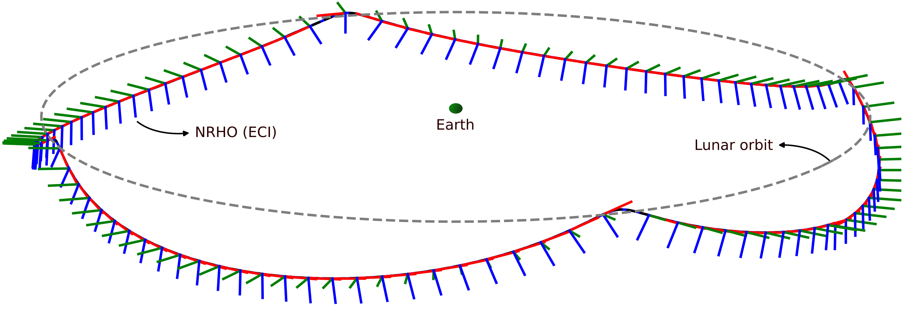

# PHODCOS
**PHoDCOS — Pythagorean Hodograph-based Differentiable Coordinate System**


For the implementation details, please check the [paper](https://arxiv.org/pdf/2410.07750).
<!-- and/or watch the [video](coming soon ...). -->

If you use this framework please cite our work:

```
@misc{arrizabalaga2024phodcospythagoreanhodographbaseddifferentiable,
      title={PHODCOS: Pythagorean Hodograph-based Differentiable Coordinate System}, 
      author={Jon Arrizabalaga and Fausto Vega and Zbyněk ŠÍR and Zachary Manchester and Markus Ryll},
      year={2024},
      eprint={2410.07750},
      archivePrefix={arXiv},
      primaryClass={cs.RO},
      url={https://arxiv.org/abs/2410.07750}, 
}
```

## Quickstart

<!-- Install dependencies with

```
sudo apt-get install libcdd-dev
``` -->

Create a python environment with python 3.9. For example, with conda:

```bash
conda create --name phodcos python=3.9
conda activate phodcos
pip install -r requirements.txt
```

Update the `~/.bashrc` with

```bash
export PHODCOS_PATH=/path_to_PHODCOS
export PYTHONPATH=$PYTHONPATH:/$PHODCOS_PATH
```

## Usage

### Numerical analysis: Approximation error

To reproduce the numerical analysis demonstrating a 6th-order approximation, as shown in Fig. 2 of the paper, run the following command:
```bash
python examples/hermite_interpolation.py --interp_order 4 --n_start 1  --n_end 9 --visualize
```

The options are the following ones:

- `--interp_order`: `2` or `4`.
- `--n_start`: Minimum number of segments when benchmarking.
- `--n_end`: Maximum number of segments when benchmarking.
- `--n_eval`: Multiplicity of discretization (per segment) when evaluating.
- `--visualize`: Enable visualization.


### Near-Rectilinear Halo Orbit (NRHO)
To assign PHODCOS to the [Near-Rectilinear Halo Orbit (NRHO)](https://en.wikipedia.org/wiki/Near-rectilinear_halo_orbit) chosen for the [Lunar Gateway](https://en.wikipedia.org/wiki/Lunar_Gateway) run the following command:

```bash
python examples/lunar_gateway.py
```

This will perform two parameterizations of the NRHO: one in the Earth-Centered Inertial (ECI) frame and the other in the Earth-Moon Barycentric Rotating (EMBR) frame. This is done both in normalized as well as SI units, resulting in a total of four parameterizations.  These will be saved in the [data folder](examples/data) for use in the [lunar lander example](examples/lunar_lander.py) or for [visualization](examples/data/figures/parameterization_plots.py).

### Lunar Lander: Trajectory optimization from the Moon to the NRHO
To replicate the trajectory optimization example of the paper, run the following command:

```bash 
python examples/lunar_lander.py --case_study 0
```
where `--case_study` can be `0,1,2,3,4`. This will save the results in the [data folder](examples/data), which can be used for [visualization](examples/data/figures/navigation_plots.py).

**Note**: This example assumes that you have run the NRHO example first.
